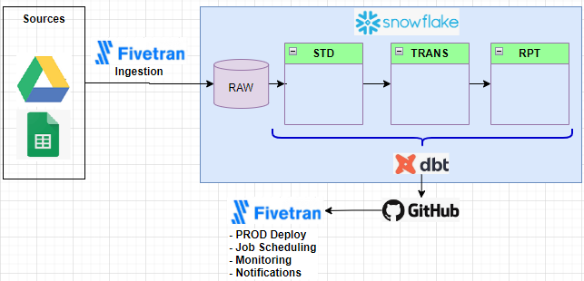

# DBT project

Data pipelines based on `dbt-core` project structure
Data Stack:
- DBT
- Snowflake (as target Cloud DW)
- Fivetran

## Setup
- Quickly installation (preferably in a virtual environment):
```sh
pip install -r requirements.txt
dbt --version
```
- Configure profile.yml with Snowflake connection details
- Run dbt commands:
```sh
dbt deps
dbt seed
# run and test all models
dbt build
```
## Case Study
- *Goal*: Data startup analysys
- Sources (previously ingested via Fivetran):
   - [`yc_startups.json`](https://www.kaggle.com/datasets/thakurthegreat/ycombinator-startups): startups that have received funding from Y Combinator up to the year 2024
   - [`unicorns.csv`](https://www.kaggle.com/datasets/thedevastator/startups-valued-at-1-billion-or-more): Startups Valued at $1 Billion or More
- Overall Architecture:


